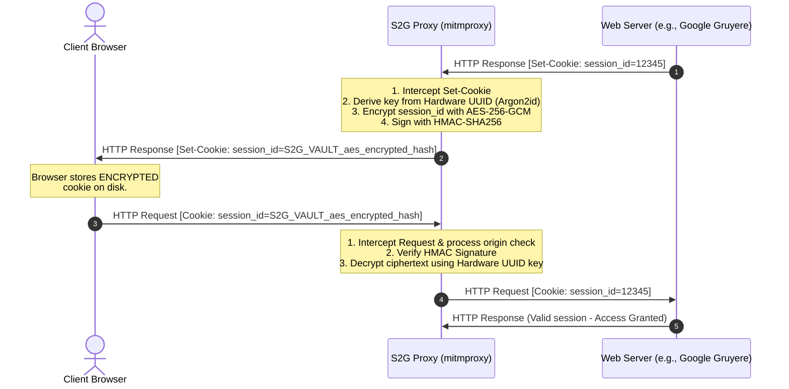

# S2G Proxy (Session-to-Gate)
### Client-Side Zero-Trust Session Hijacking Protection Enforcer

S2G Proxy is a security simulation and enforcement tool designed to prevent **Session Hijacking** (also known as Cookie Theft or Pass-the-Cookie attacks). It demonstrates how typical web browser session databases can be easily compromised by malware, and provides a powerful, client-side zero-trust solution using transparent cookie encryption tied to the machine's hardware UUID.

---

## 🚨 The Threat: Why Standard Browser Cookies are Vulnerable
Normally, Chromium-based browsers (Chrome, Edge, Brave, etc.) encrypt cookies on Windows using the **Windows Data Protection API (DPAPI)**. 
* While DPAPI is secure against external offline extraction (e.g., if someone steals your hard drive), it is **not secure** against malware or scripts running *on the same machine* under the *same user account*.
* Any user-level script or malware (running without admin privileges) can call DPAPI to decrypt the browser's master key, copy the local SQLite `Cookies` database, and decrypt all session cookies.
* Once the raw session cookie (e.g., a session ID) is stolen, the attacker can use it from **any computer in the world** to fully hijack the user's logged-in session, completely bypassing Multi-Factor Authentication (MFA).

---

## 🛡️ The Solution: How S2G Proxy Works
S2G Proxy introduces a **Zero-Trust Client-Side Intermediary** that transparently encrypts session cookies before they are saved to the browser's disk, and binds the decryption capability strictly to the **machine's unique hardware identifier (UUID)**.



### 1. Transparent Hardware-Bound Encryption
* **Hardware Binding**: S2G queries the machine's hardware BIOS/system UUID (`wmic csproduct get uuid` on Windows) and derives a 256-bit master key using **Argon2id** (with a static pepper).
* **Transparent Decryption (Outbound)**: When the browser sends an HTTP request, S2G intercepts it, identifies the protected cookies prefixed with `S2G_VAULT_`, verifies their integrity via an **HMAC-SHA256** signature, decrypts them using the hardware key, and sends the raw cookie to the web server.
* **Transparent Encryption (Inbound)**: When the web server returns a `Set-Cookie` header, S2G intercepts it, encrypts the raw session value with **AES-256-GCM**, appends the `S2G_VAULT_` prefix, and forwards it to the browser.
* **Result**: The browser database only ever stores encrypted gibberish. If malware steals the database, the cookie is **useless** because it cannot be decrypted on any other machine.

### 2. Zero-Trust Process Firewall
S2G inspects the network sockets of incoming connections.
* It restricts connections strictly to the loopback address (`127.0.0.1`).
* It checks the process ID (PID) of the application connecting to the proxy using `psutil`.
* If a non-authorized process (e.g., `python.exe`, `curl.exe`, or malware) tries to route a request through the proxy to use the decrypted cookies, S2G **terminates the connection** immediately. Only whitelisted browser processes (`chrome.exe`, `msedge.exe`, `firefox.exe`, `brave.exe`) are allowed.

---

## 📁 Repository Structure

* 🖥️ **`app.py`**: The PyQt6-based graphical dashboard. It allows you to configure and run the S2G proxy, streams proxy logs in real time, and runs a background thread to detect packet-sniffers (like Wireshark/Npcap).
* ⚙️ **`proxy_addon.py`**: The `mitmproxy` script containing the `SessionEnforcer` class. This handles connection routing, whitelisted browser checks, and the transparent intercept-encrypt/decrypt logic.
* 🔐 **`crypto_module.py`**: The cryptographic engine. It handles retrieval of the hardware UUID, Argon2id key derivation, AES-256-GCM encryption/decryption, and HMAC generation/verification.
* 🕵️ **`cookie_stealer_poc.py`**: A simulated malware Proof of Concept. Running this as Administrator simulates a credential-stealer that copies and decrypts the browser's SQLite databases, showing how easily standard cookies are stolen, and demonstrating how S2G renders them useless.
* 🚨 **`demo_attacker.py`**: A simulated attacker script that attempts to route a request with a fake stolen session cookie through S2G, showcasing how S2G's Zero-Trust Firewall blocks unauthorized processes at the network level.
* 🌐 **`start_browser_demo.bat`**: A convenient script that launches an isolated Chrome instance configured to route traffic through the S2G proxy, targeted at **Google Gruyere** (a deliberately vulnerable training application).

---

## 🚀 Step-by-Step Demo Guide

Follow these steps to experience S2G Proxy in action:

### Step 1: Install Dependencies
Ensure you have Python installed, then run:
```bash
pip install -r requirements.txt
```

### Step 2: Start the S2G Dashboard
Run the PyQt6 interface:
```bash
python app.py
```
* Change the listening port if needed (default: `8080`).
* Click **🚀 Start Enforcer**. The status will change to **Active & Protected** and the system logs will start.

### Step 3: Launch the Secure Browser Demo
Run the provided batch script to launch an isolated Chrome session routed through the proxy:
```bash
start_browser_demo.bat
```
* This opens Google Gruyere in Chrome with certificate errors ignored (simplifying the demo so you don't have to install the mitmproxy Root CA on your OS).

### Step 4: Test and Observe Session Encryption
1. On the Google Gruyere page, click **Sign Up** to create a demo account, then log in.
2. Open Chrome Developer Tools (`F12` or `Ctrl+Shift+I`).
3. Navigate to **Application -> Storage -> Cookies -> https://google-gruyere.appspot.com**.
4. Find the **`GRUYERE_ID`** cookie. Notice that its value is encrypted and starts with **`S2G_VAULT_...`**!
5. Despite the cookie being encrypted in Chrome's storage, the web app functions normally because S2G transparently decrypted it in transit.

### Step 5: Simulate Malware Cookie Theft
Keep the browser open and run the malware simulator:
```bash
python cookie_stealer_poc.py
```
* This script will prompt for UAC elevation to simulate advanced malware access.
* It reads Chrome's database directly and tries to decrypt the `GRUYERE_ID` cookie.
* **Observe the output**: It successfully steals the cookie, but the decrypted value is just the `S2G_VAULT_...` ciphertext! If this were stolen by real malware, they would not be able to use it to hijack your account on their machine.

### Step 6: Simulate Network Session Hijacking (Block Attack)
While S2G is running, run the attacker script:
```bash
python demo_attacker.py
```
* This script tries to send a request to Google Gruyere using a stolen cookie routed through the S2G proxy.
* **Observe the output**: The connection is immediately terminated. The dashboard will log that `python.exe` was blocked because it is not an authorized browser process.
